# Unified Site Management

[](https://github.com/JasonMossotti/dco-vendor-scorecard/actions/workflows/ci.yml)
[](https://github.com/JasonMossotti/dco-vendor-scorecard/actions/workflows/pages.yml)

**Site operations for a partner-operated GPU data center, verified with independent telemetry instead of partner self-reporting.**

**▶ [Open Unified Site Management](https://jasonmossotti.github.io/dco-vendor-scorecard/)**, the live demo: scorecards, an alarm board, an incident portal, a post-incident review, a weekly operations review, a failure pattern review, the contracts, a glossary, and a device directory, all built from one synthetic site and one set of contracts.

> Portfolio demonstration. All data, parties, sites, and commercial terms are synthetic and fictional. Not affiliated with, or based on internal information from, any real company.

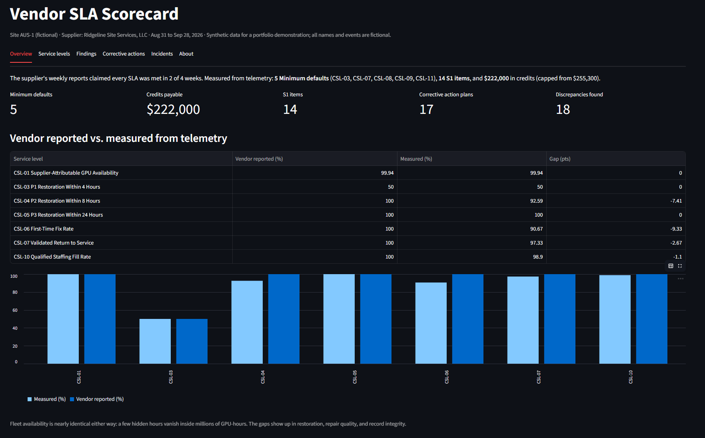

## In 30 seconds

At a partner-operated site, partners do the hands-on work and the Customer's site lead owns the outcome. The fictional Site AUS-1 in Central Texas has two partners: a **Landlord** (Caprock Critical Facilities) that runs the building, power, cooling, and CDUs, and an **IT Partner** (Ridgeline Site Services) that does the data hall work. Both report that every SLA was met. This project rebuilds every incident from the equipment's own telemetry and finds otherwise:

| | IT Partner (Ridgeline) | Landlord (Caprock) |
|---|---|---|
| Self-report | Every SLA met or minor exceptions | Every SLA met |
| Measured Minimum Service Level Defaults | **4** (CSL-07, 08, 09, 11) | **4** (OT-CSL-01, 06, 07, 08) |
| Credits | **$188,700** payable (inside the $222,000 cap) | **$106,200** against rent |
| Findings (records that do not reconcile with telemetry) | 18 (14 S1) | 8 (7 S1) |
| Engine self-check on planted discrepancies | 17 of 17; **1,020 of 1,020** across 60 unseen months, 0 false positives | 8 of 8; **480 of 480** across 60 unseen months, 0 false positives |

One outage crosses the boundary between them: during planned work on rack A07's A-side power, the Landlord opens the B-side tap-off by mistake and the rack goes dark for 3.4 hours. The Customer's telemetry attributes it to the Landlord under the Interface Agreement, so it stays off the IT Partner's scorecard (scored without attribution, the IT Partner would show 5 defaults and $222,000). That one event is followed through every page below.

## Contents

| Page | The question it answers | Live |
|---|---|---|
| [Overview](#overview) | How are both partners doing this month? | [open](https://jasonmossotti.github.io/dco-vendor-scorecard/) |
| [Scorecards](#scorecards) | What did each partner report, and what does the telemetry say? | [open](https://jasonmossotti.github.io/dco-vendor-scorecard/app/) |
| [Alarm Board](#alarm-board) | Which alarms are expected from approved change work, and which are not? | [open](https://jasonmossotti.github.io/dco-vendor-scorecard/alarms/) |
| [Incident Portal](#incident-portal) | What do the partners' own tickets and work orders say, record by record? | [open](https://jasonmossotti.github.io/dco-vendor-scorecard/tickets/) |
| [Post-Incident Review](#post-incident-review) | What happened in an event, why, and what are we doing about it? | [open](https://jasonmossotti.github.io/dco-vendor-scorecard/pir/) |
| [Weekly Review](#weekly-operations-review) | What do we discuss with both partners this week? | [open](https://jasonmossotti.github.io/dco-vendor-scorecard/weekly/) |
| [Failure Patterns](#failure-pattern-review) | Which failures cluster beyond chance, and who owns the fix? | [open](https://jasonmossotti.github.io/dco-vendor-scorecard/patterns/) |
| [Energy](#energy-and-pue) | What is the site's PUE, and does the Landlord's report reconcile with the meters? | [open](https://jasonmossotti.github.io/dco-vendor-scorecard/energy/) |
| [GPU Health](#gpu-health) | Which GPUs are failing, or about to, and whose side is it on? | [open](https://jasonmossotti.github.io/dco-vendor-scorecard/gpu/) |
| [Telemetry](#telemetry) | What is every GPU reading, minute by minute, and does it agree with the records? | [open](https://jasonmossotti.github.io/dco-vendor-scorecard/telemetry/) |
| [Deployments](#deployments) | Where is the Hall B rollout, and do the partners' records of it hold up? | [open](https://jasonmossotti.github.io/dco-vendor-scorecard/deployments/) |
| [Agreements](#agreements-slas-as-code) | What exactly did each party agree to? | [open](https://jasonmossotti.github.io/dco-vendor-scorecard/agreements/) |
| [Glossary](#glossary-and-code-popups) | What does this code mean, and where is it defined? | [open](https://jasonmossotti.github.io/dco-vendor-scorecard/glossary/) |
| [Devices](#devices-location-pins-and-detail-sheets) | What is this device, where is it, and what does it connect to? | [open](https://jasonmossotti.github.io/dco-vendor-scorecard/devices/) |

Then: [how it fits together](#how-it-fits-together), [the site](#the-site), [the data and the engines](#the-data-and-the-engines), [measuring on months the code never saw](#measuring-on-months-the-code-never-saw), [toward live data](#toward-live-data-the-read-only-collector), [tests and deployment](#tests-and-deployment), [run it locally](#run-it-locally), and the [project layout](#project-layout).

## How it fits together

Everything is generated from three sources of truth: the contracts (`sla/*.yaml`), the site (`site/site.yaml`), and the dataset (`data/`). No page, report, or document is written by hand except the human judgment (review narratives, meeting notes, lessons), which lives in YAML and is tested against the facts.

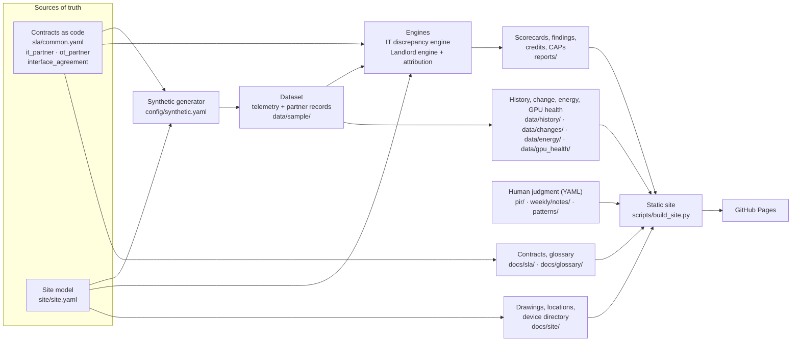
```mermaid
flowchart LR
  subgraph truth[Sources of truth]
    SLA["Contracts as code<br/>sla/common.yaml<br/>it_partner · ot_partner<br/>interface_agreement"]
    SITE["Site model<br/>site/site.yaml"]
  end
  GEN["Synthetic generator<br/>config/synthetic.yaml"]
  GEN --> DATA["Dataset<br/>telemetry + partner records<br/>data/sample/"]
  SITE --> GEN
  SLA --> GEN
  DATA --> ENG["Engines<br/>IT discrepancy engine<br/>Landlord engine + attribution"]
  SLA --> ENG
  SITE --> ENG
  ENG --> REP["Scorecards, findings,<br/>credits, CAPs<br/>reports/"]
  DATA --> HIST["History, change, energy, GPU health<br/>data/history/ · data/changes/ · data/energy/ · data/gpu_health/"]
  REP --> PAGES
  HIST --> PAGES
  JUDG["Human judgment (YAML)<br/>pir/ · weekly/notes/ · patterns/"] --> PAGES
  SLA --> DOCS["Contracts, glossary<br/>docs/sla/ · docs/glossary/"]
  SITE --> DWG["Drawings, locations,<br/>device directory<br/>docs/site/"]
  DOCS --> PAGES
  DWG --> PAGES
  PAGES["Static site<br/>scripts/build_site.py"] --> GH["GitHub Pages"]
```

Every page is a static HTML file with its data embedded as JSON, so it loads instantly and needs no server. The one exception is the Scorecards app, which runs the real Python pipeline in the browser.

## Overview


**What it shows.** The landing page: both partners' self-report beside the measured result, then one card per function with its headline numbers (120 alarms this month, 11 expected from change work, 4 outside declared impact; 119 partner records, 27 that do not reconcile) and a button into each. A tab bar at the top of every page reaches every function.

**How it works.** `scripts/render_hub.py` fills `templates/hub.html` by computing every number with the same data and code as the page it links to, and `tests/test_hub.py` checks they agree, so the overview can never disagree with a report. The tab bar is defined once in `src/scorecard/sitenav.py` and injected into every page by `scripts/build_site.py`, which also links every ticket number on a page to its record in the Incident Portal.

## Scorecards

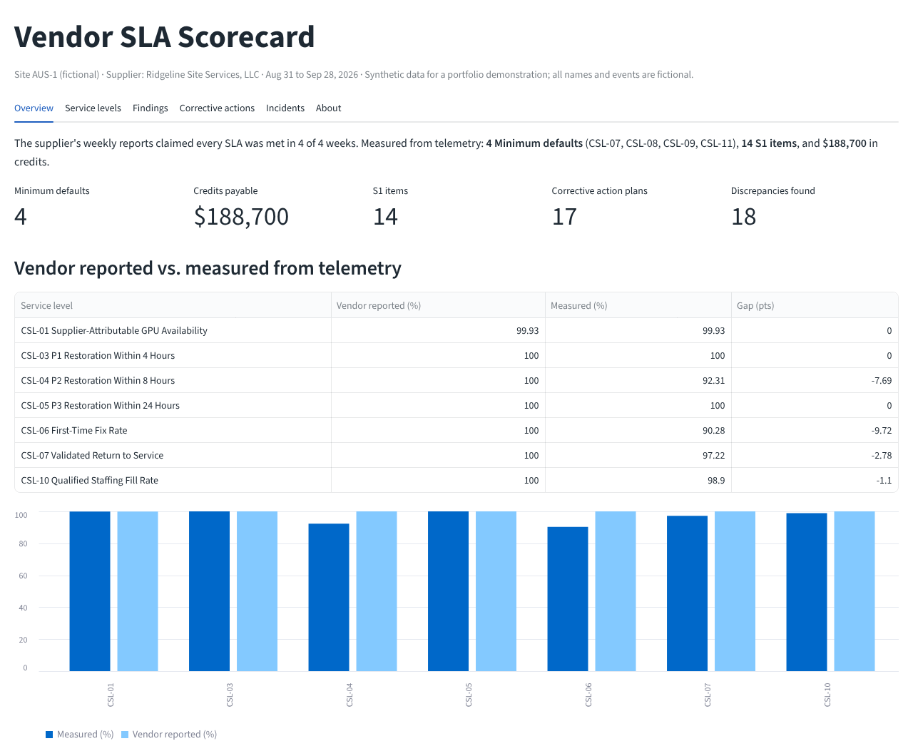

**What it shows.** The interactive scorecard app with three views: a **site summary** (both partners side by side, the outage that crossed the demarcation, and what attribution changed), the **IT Partner** scorecard, and the **Landlord** scorecard. Each shows service levels reported vs. measured, credits, the severity log, corrective action plans, and every finding with its evidence. A dataset picker switches between the committed sample, the latest 4 weeks (regenerated every Monday by GitHub Actions), and a brand-new random month generated on the spot.

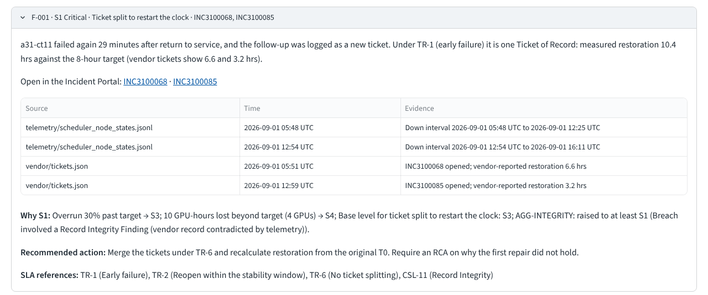

*A finding: a compute tray failed again 29 minutes after return to service and the follow-up was logged as a new ticket. Under ticket rule TR-1 it is one Ticket of Record, measured at 10.4 hours against the 8-hour target. The evidence rows are the exact telemetry and ticket records.*

**How it works.**
- A Streamlit app (`app/streamlit_app.py`) that runs **entirely in the browser** through [stlite](https://github.com/whitphx/stlite) (Python on WebAssembly). No server: the first visit takes 20 to 40 seconds while Python boots.
- `src/scorecard/app_support.py` runs the same pipeline the command line runs: generator, engines, `build_scorecard(sla, result)`. The scorecard is a pure function of the contract and the data, so a contract amendment is a one-line YAML change and the effect on breaches and credits shows on the next run.
- Service levels are measured from telemetry in `src/scorecard/kpi.py`, using the contract's ticket handling rules (`src/scorecard/measurement.py`, TR-1 to TR-7). Credits, the monthly cap, and the S1 to S4 severity index come from `src/scorecard/sla_model.py`.
- The app is tested in CI against a fake Streamlit (`tests/fake_streamlit.py`) that records every element it renders.

## Alarm Board

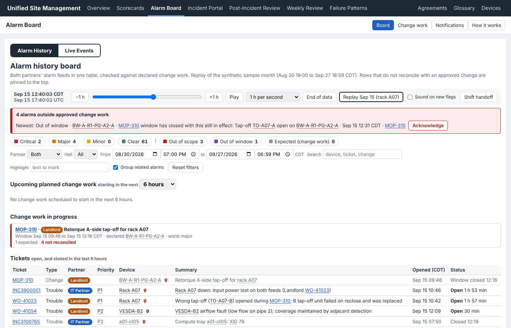

**What it shows.** Both partners' alarm feeds in one table, each alarm checked against the change work that was approved at that moment. Under Interface Agreement section 10, every change declares the assets it touches, the alarms it expects, the worst severity it may cause, and its window. On the sample month the check flags exactly the rack A07 outage: the B-side tap-off opening during A-side work, and the A side still open after the window closed, which nothing else alerted on.

- **Alarm History** replays the month with a time slider, play speed, and a "Replay Sep 15 (rack A07)" button. **Live Events** runs the same synthetic feed re-dated to the viewer's clock (labeled as simulated) with open trouble tickets and a 6-hour reap time.
- Severity and change-work filters, a period picker in site time, acknowledgment, repeat tallies, flood grouping of related alarms, an alert banner, and a one-click shift handoff.
- **Change work** lists every change with its own timeline; upcoming work is flagged against conflicting changes and open trouble.
- **Notifications** holds the Customer's routing: an on-call schedule and an event matrix that decide who is texted or emailed, with escalation and a replay of the month.

**How it works.**
- `src/scorecard/alarms.py` runs three pure functions. `normalize` turns every alarm-bearing source (BMS, UPS cards, busway monitors, EPMS, CDU controllers, leak and VESDA panels; Redfish, NVLink, fabric, GPU, and scheduler feeds) into one list with four severities, a domain, and the partner ticket raised for it. `classify` checks each alarm against the change declarations active at that instant: **expected**, **out of scope** (undeclared, too severe, or on *connected* equipment, found by walking the site model's power and cooling paths), **out of window** (started early, or left in maintenance after the window), or not change work. `measure_notifications` compares what each party owed (NT-1 to NT-3) with its delivery log.
- The change layer (declarations and delivery logs, `data/changes/`) is generated on its own random stream (`scripts/generate_changes.py`), so adding it changed none of the existing records or reports.
- The alarm map and change-type catalog live in `config/change_alarms.yaml`. `scripts/render_alarms.py` writes the page and `reports/change_alarms.md`.
- Scored on 60 generated months with planted cases: every case found 60 of 60, decoys flagged 0 of 60. A flag means the records do not reconcile with the approved change, not that anyone did anything wrong.

## Incident Portal

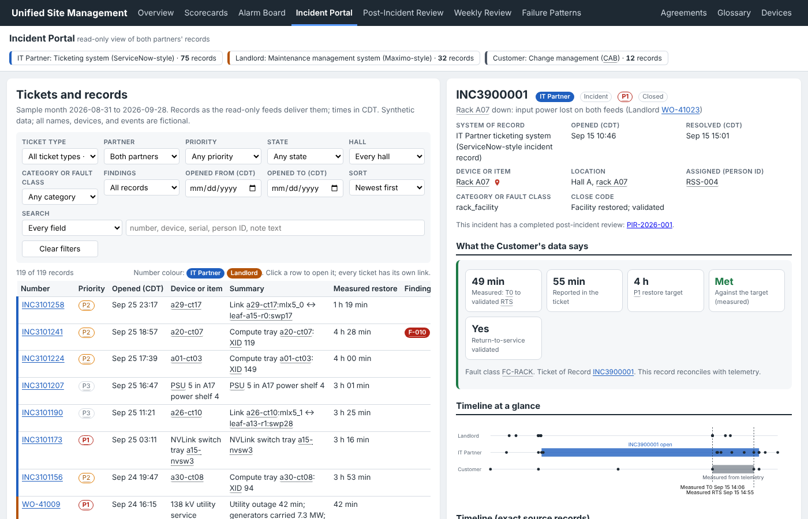

**What it shows.** Every partner record of the sample month the way the Customer's read-only records access would deliver it: 75 IT Partner incidents (ServiceNow-style INC records), 2 CHG changes from the Customer's change board, 14 Landlord work orders and 18 PM tasks (Maximo-style maintenance records), and 10 MOPs, 119 in all. Drop-downs filter by type, partner, priority, state, hall, category, findings, and dates; the search looks in every field or just one (number, device, part or serial, person ID, work notes, alarm, finding). Each record opens with the partner's fields exactly as stored, **what the Customer's data says** (measured T0 to validated return to service beside what the ticket reported), a timeline at a glance with one lane per party, the exact source records, its alarms, the findings that name it, and related records: the links the records make, the relations a person confirmed, and leads suggested by the data with the reasons that scored them and a button to confirm or deny each one.

**How it works.**
- `src/scorecard/tickets.py` assembles each record from the dataset. Tickets and work orders reuse the post-incident review's timeline builder (`pir.build_review`); changes add the rack's Redfish inventory changes; MOPs add their work orders and PM tasks; PM tasks add the engineer's badge entries.
- The measurement comes from the same scorecard JSON the app shows, so the portal and the scorecards cannot disagree.
- Every INC, CHG, WO, MOP, and PM number anywhere on the site links here (`#INC3900001`), including inside the Scorecards app.
- Every record carries **Start post-incident review**, which opens the review form filled from that record's own facts, or a link to the completed review when there is one.
- **Related records** separates three things a reader should never have to untangle: the links the records themselves make, the relations a person has confirmed (`tickets/relations.yaml`, with the role who confirmed each and why), and leads **suggested by the data**, each with the reasons that scored it and a **Confirm** or **Deny** button. A relation can also be added by number, with a type of related, duplicate, or follow-up. Confirmations are kept in your own browser and **Export YAML** gives the file they are committed as.
- The suggestions are scored, not guessed: `src/scorecard/relations.py` awards points for place (same device, same rack, a connected device in the device directory, a shared power group or busway or row CDU), time (overlapping windows, within an hour, same day), and shared evidence (the same alarm, the same part or serial, a finding that names both, a MOP covering the work), and nothing qualifies on place or time alone. Every weight and the reason for it is published in `config/relations.yaml`; the person assigned is never a signal, because suggesting a relation because the same technician worked both would read as blaming a person.
- The access itself is a contract term: Records access (RA-1 to RA-6) in both SLAs requires a read-only API account, the full record history and field edit log, and data no more than 15 minutes old. The portal only reads, and shows people by person ID.

## Post-Incident Review

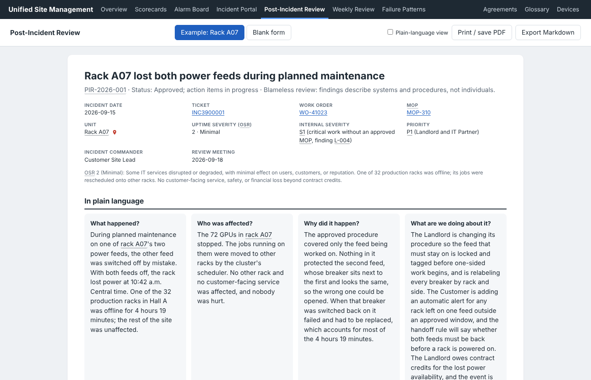

**What it shows.** A standardized, blameless review form built on Google SRE practice and the Uptime Institute's Outage Severity Rating, with three tabs:

- **Reviews**: every completed review and every draft, searchable by event date range, record number, and device name. A record number matches the review's own record and everything related to it, so searching a work order number finds the review of its incident; a device name matches the devices the record names, and optionally anything one connection away in the device directory, so a rack's compute tray finds the review of its rack.
- **Review**: a completed review, four of them so far: the cross-partner rack A07 outage, a CDU that lost pump redundancy and was closed three hours early in the records, an NVLink switch tray failure that drained a rack, and a utility outage the generators carried. Page one answers four questions in plain language for any reader (what happened, who was affected, why, what we are doing), then an impact strip and a swimlane timeline that shows each party's time in its own color.
- **Blank form**: enter any record number, or press **Start post-incident review** on any record in the Incident Portal, and every factual field fills from the data: times, response against the right partner's targets for that priority, the timeline with each source record, attribution, measurement, findings, and related records. Narratives, factors, and actions stay editable, drafts save as you type in your own browser, and **Export YAML** gives the file a signed-off review is committed as.

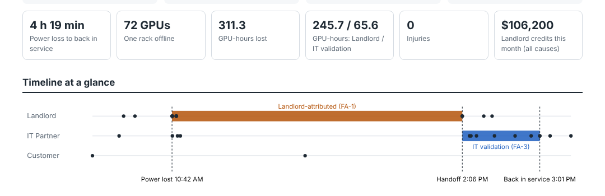

The technical sections follow: response against targets, every alarm and event reproduced exactly from its source record, the attribution decision, contract and EHS consequences, contributing factors (classified the way Uptime classifies human-error outages), lessons including where we got lucky, owned and dated action items, the communications log, a repeat-event check, and sign-off. A plain-language toggle hides the technical sections for leadership; the review prints to PDF or exports to Markdown.

**How it works.** Facts come from the data, judgment comes from people. `src/scorecard/pir.py` builds every time, duration, and source record from the dataset, for any of the 119 records the Incident Portal holds: a rack losing power is measured from the power loss through the handoff (FA-3) to the return to service, any other incident or work order from the Customer's measured start of the event against that partner's target for its priority, and a change, MOP, or maintenance task against its approved or due window and the work its records show. The written part of each review lives in `pir/reviews/*.yaml`. Tests hold the prose to the facts: every clock time and every duration a review quotes must exist in its facts, every source record must be reproduced exactly, each repeat event must be ruled in or out, no action may be shown open past its due date as of the review's own snapshot, and no review may name an individual. `scripts/render_pir.py` writes the page and one Markdown review per YAML file (for example [`docs/pir/PIR-2026-001.md`](docs/pir/PIR-2026-001.md)); a jsdom browser test exercises the page, its search, and its drafts in CI.

## Weekly Operations Review

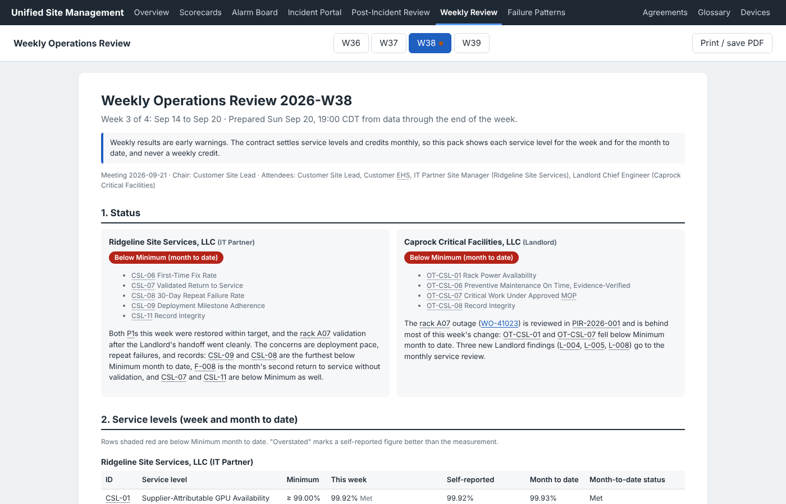

**What it shows.** The pack the Customer's site lead brings to the weekly joint review with both partners, one per week of the sample month, in meeting order: a status line per partner (on track, at risk, or below Minimum month to date), every service level for the week and month to date beside the partner's own report with overstated figures flagged, P1 incidents in full and P2 exceptions, new findings, open post-incident actions, a seven-day look-ahead (approved MOPs and changes, maintenance due, Hall B handoffs, rostered shifts), staffing, spares, safety, and the meeting's decisions, priorities, and asks.

**How it works.** `src/scorecard/weekly.py` computes each pack with the same engines as the monthly scorecards, as of the end of its week. Three rules keep it honest, and each is a test:
- **Early warnings, not credits.** The contract settles monthly, so a weekly pack never shows a credit.
- **Nothing known early.** A pack uses only what existed by the end of its week; a finding appears in the week its discrepancy was observed.
- **The weeks reconcile with the month.** The last week's month to date equals the monthly scorecards for both partners, weekly power availability averages exactly to the monthly figure, and every finding and incident is counted exactly once, on the sample and on 20 generated months.

Decisions and asks are written in `weekly/notes/2026-W38.yaml`; `scripts/render_weekly.py` writes the page and [`docs/weekly/`](docs/weekly/).

## Failure Pattern Review

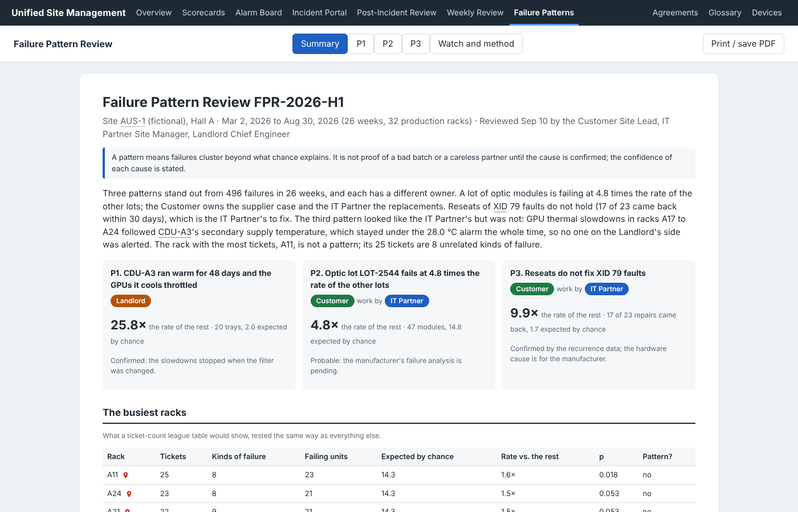

**What it shows.** The half-year review of every failure in Hall A before the sample month (496 failures in 26 weeks). Three patterns stand out, each with a different owner from the Interface Agreement's ownership matrix: an optic lot failing at 4.8 times the rate of the other lots (Customer and IT Partner), reseats that do not fix XID 79 faults (IT Partner), and GPU thermal slowdowns caused by a CDU that ran warm for 48 days without reaching its alarm (Landlord, although every ticket sat in the IT Partner's queue). The rack with the most tickets is not a pattern.

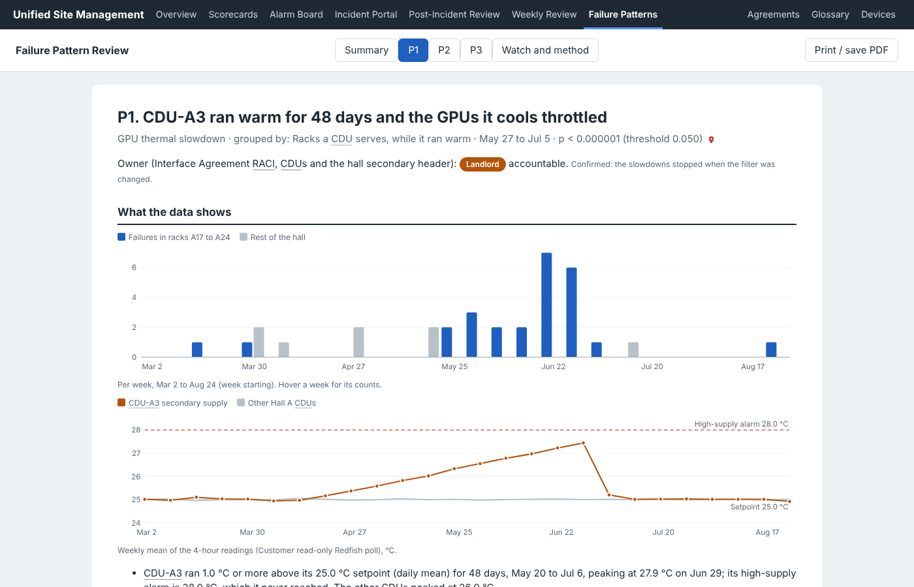

**How it works.**
- Failures come from telemetry (DCGM, UFM, Redfish), never from ticket text; tickets supply only the fix that was applied.
- `src/scorecard/patterns.py` groups failures by rack, the racks a CDU serves, tray slot, optic lot, and the fix applied. Location and lot groups get an **exact binomial test** of their share of failures against their share of the installed base; fix effectiveness gets a **one-sided Fisher exact test** of 30-day recurrence. A group is a pattern only with enough failures, a rate well above the rest, and a p-value under the threshold divided by the number of tests in its family (**Bonferroni**). High ratios that chance could still explain become watch items.
- For each pattern the analysis checks the evidence for a cause on each side of the demarcation and looks the component up in the RACI to name the owner.
- The history (`data/history/`) is generated on its own random stream by `scripts/generate_history.py`. Root causes, lessons, and standard-work changes are written in `patterns/lessons.yaml` and tested against the facts.
- Scored on 60 generated histories with the patterns moved each time: optic lot 60 of 60, CDU drift 60 of 60, reseat 41 of 60, decoys 0 of 60.

## Energy and PUE

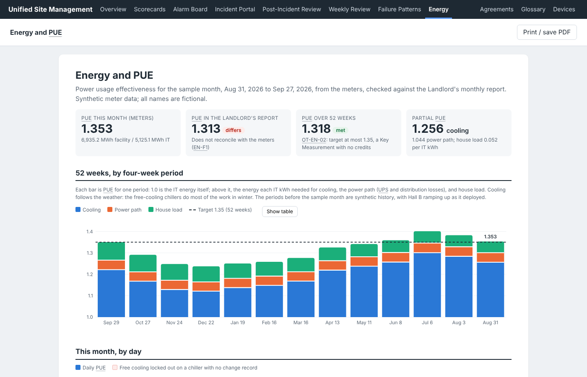

**What it shows.** Power usage effectiveness for the sample month from the site's meters (1.353), set beside the PUE in the Landlord's monthly energy report (1.313) and the 52-week PUE the Landlord SLA tracks (1.318 against a target of at most 1.35). A stacked bar per four-week period splits PUE into cooling, the power path, and house load, so the free-cooling winters and the hot summers are visible; a daily line shows the month. Two findings: the report does not reconcile with the meters (its PUE matches IT energy read at the UPS inputs instead of the outputs), and a chiller's free cooling was left off for six days after maintenance with no change record.

**How it works.**
- PUE follows ISO/IEC 30134-2:2026: total facility energy (utility revenue meters, plus generator energy only while the generators carried the site in an outage) divided by IT energy (UPS output meters), both as energy over the period. Partial PUE splits the overhead into cooling, power path, and house load.
- `src/scorecard/synthetic/energy.py` generates hourly meters on its own random stream: IT energy follows the sample's UPS readings, and cooling follows a Central Texas weather model and a free-cooling chiller plant (`config/energy.yaml`, every assumption marked). The 12 four-week periods before the sample are synthetic history.
- `src/scorecard/energy.py` recomputes the report's PUE the common wrong ways (UPS inputs as IT, house load left out, generator energy left out) and names the one that matches; it reads the chiller free-cooling log for lockouts over 24 hours and estimates their extra energy with the plant model.
- The terms are Landlord SLA section 22 (OT-EN-01 monthly report, OT-EN-02 PUE over 52 weeks, OT-EN-03 free-cooling availability). PUE is a Key Measurement with no credits, so the Landlord's credits are unchanged. The weekly packs carry the week's and month-to-date PUE, tested to reconcile with this report.
- Scored on 60 generated months with the report error and the lockout moved each time: every report error found (49 of 49, cause named each time), every lockout found, 109 of 109 in all, no report flagged when it was right (11 of 11), 0 false positives.

## GPU Health

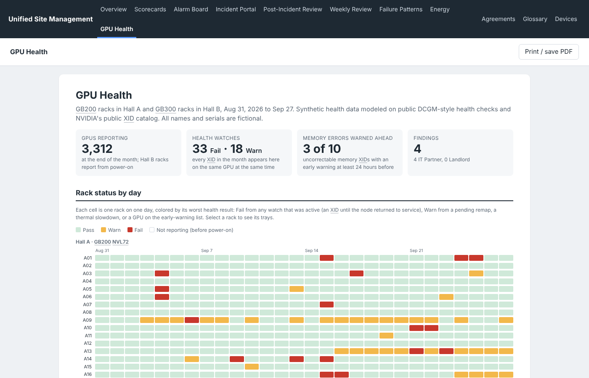

**What it shows.** Every GB200 rack in Hall A and every powered-on GB300 rack in Hall B, one cell per rack per day, colored by its worst health result; selecting a rack lists its trays and what each one raised. Four findings, all on the IT Partner's side: a GPU whose corrected memory errors are rising with no failure yet (drain and replace it now), two nodes returned to service while a GPU still had a row remap pending (one is the existing phantom fix, seen from the health data), and a tray throttling while its CDU held the rack band (the cause is inside the rack). Three of the month's ten uncorrectable memory errors were flagged at least a day ahead.

**How it works.**
- The data is synthetic, modeled on public DCGM-style health checks and NVIDIA's public XID catalog, on its own random stream (`src/scorecard/synthetic/gpu_health.py`, `config/gpu_health.yaml`, every threshold an assumption). Every XID already in the month appears as a health watch on the same GPU at the same time and clears when the scheduler returns the node to service or the tray is replaced, so nothing contradicts the records shown elsewhere.
- `src/scorecard/gpu_health.py` flags GPUs whose remapped rows or corrected errors are rising, checks every return to service for a remap still pending, and walks thermal slowdown across the cooling demarcation (DM-COOL): a CDU out of band puts it on the Landlord's side, a CDU in band puts it inside the rack.
- The month's two CDU pump trips dipped flow inside the band and throttled no GPU, which matches the attribution report and OT-CSL-03 at 100%.
- Scored on 60 generated months with the cases moved each time: every planted case found, 548 of 548 (early warning 360/360, remap pending at return 97/97, hot trays 60/60, CDU excursions 31/31), 0 false positives against 1,942 stable remaps, 120 error bursts, and 1,159 brief slowdowns.

## Telemetry

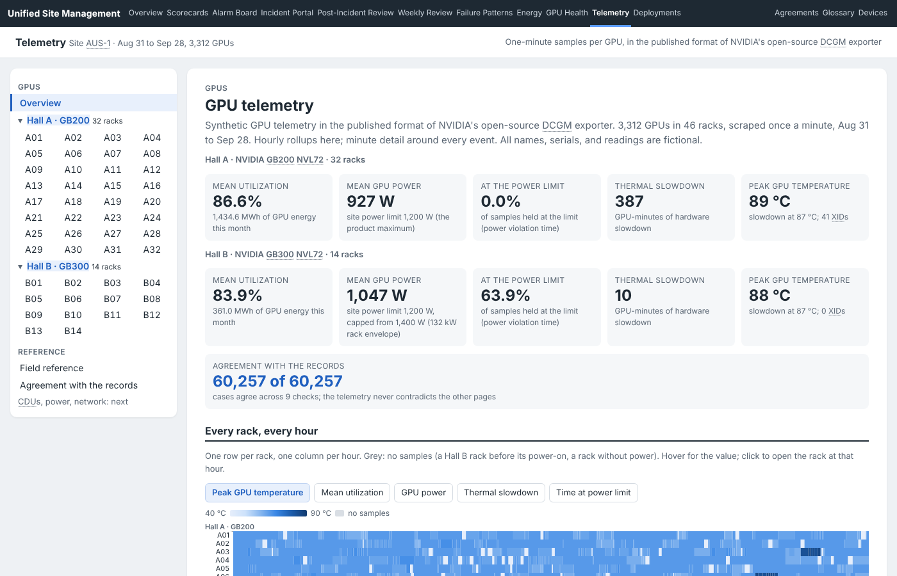

**What it shows.** Every GPU at the site (3,312 in 46 racks) sampled once a minute for the month, in the published format of NVIDIA's open-source DCGM exporter: temperature, memory temperature, power, energy, utilization, SM clock, memory used, tensor activity, the last XID, remapped rows, pending remaps, corrected errors, and the time spent throttled for heat or power. A heatmap of every rack by hour opens a rack's 72 GPUs at any hour, and a GPU's month by hour, with its XIDs, drains, and slowdowns marked and linked to their tickets. Around each event the page has one-minute detail for the tray's four GPUs, and shows the exporter's own text output (`/metrics`) at any of those minutes. Hall B's GB300s are capped at 1,200 W to fit the 132 kW rack envelope, so they spend much of the month held at that limit.

**How it works.**
- The data is synthetic and on its own random stream (`src/scorecard/synthetic/telemetry.py`, `config/telemetry.yaml`): field names, metric types, help text, and labels as the exporter publishes them; a workload model per rack (one job per NVLink domain, checkpoints, restarts after a GPU fault, burn-in on Hall B until each node's validated handoff); temperature following power above the CDU supply. Every number is an assumption or a cited public figure.
- It is shaped never to contradict the records the other pages show, and `src/scorecard/telemetry.py` checks that from what the telemetry publishes: each rack's daily peak and each counter row's peak (in whole degrees, as the exporter reports), every XID at its minute, drains with nothing running, the rack A07 power loss as a gap with no samples (not zeros) matching the Landlord's record, slowdown temperatures only inside recorded episodes, remapped rows and corrected errors day by day, Hall B silent before power-on, and GPU energy below the UPS output. On the sample, 60,257 of 60,257 cases agree.
- Storage is tiered as a real site would: rack hourly and one-minute windows around events are committed (`data/telemetry/gpu/`); the per-GPU hourly tier (about 37 MB) is built when the site is published, and its checksums are committed so the tests catch any drift.
- Building it found one disagreement in the GPU Health data itself: a brief slowdown could read higher than its rack's recorded daily peak. The GPU Health generator now records the higher reading (18 rack-days changed by under 1 °C; no finding or headline moved).

## Deployments

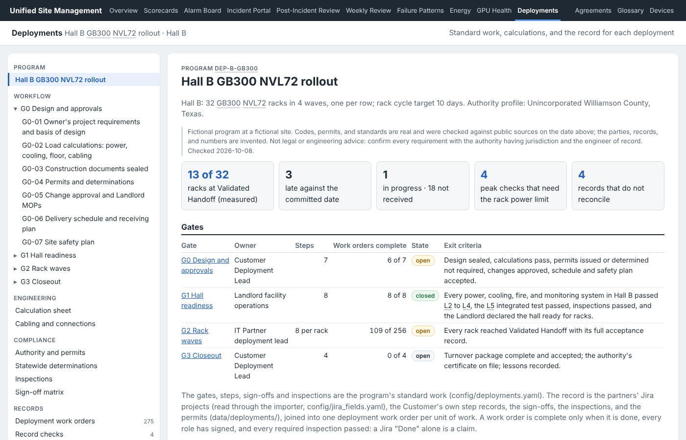

**What it shows.** The Hall B rollout of 32 GB300 NVL72 racks as a tree of gates and steps: G0 design and approvals, G1 hall readiness (commissioning levels L2 to L5), G2 the rack waves (milestones M1 to M7 per rack, plus the Landlord's tap-off energization under Interface Agreement HO-4), and G3 closeout. Each step has its procedure, acceptance criteria, records, sign-off chain by role, and inspections, including the Williamson County Fire Marshal's permits and finals. The calculation sheet checks power, cooling, floor loading, and cabling against the site model, and shows why the 132 kW rack power limit is a required setting at the reported 155 kW peak. Both partners' Jira projects become 275 deployment work orders. A work order is complete only when it is done, every role has signed, and every required inspection has passed. Four records in the sample do not reconcile. One is the Landlord energizing rack B02's tap-off 2.5 hours before the IT Partner's leak test.

**How it works.**
- Standard work is configuration (`config/deployments.yaml`): gates, steps, sign-off roles, and the authority profile. The county is the default and a city is one line away. To use the tab on a real deployment, replace the YAML and point the importer at a real Jira export. The engine and the page do not change.
- `src/scorecard/jira_import.py` reads a Jira Cloud search export (JSON pages from `/rest/api/3/search/jql`) or a CSV export. It uses a field map (`config/jira_fields.yaml`) because custom field ids differ from site to site. It never writes to Jira and never reads assignees.
- The synthetic record (`src/scorecard/synthetic/deployments.py`) uses its own random stream. The IT Partner's rack milestones in Jira are the same self-report the scorecard measures (CSL-09), to the second.
- Four record checks (`deployments.checks`) read only the work orders:
  - done without every sign-off after 7 days;
  - done without a passed inspection;
  - signed before the work was done;
  - done before the step it depends on.
- Each weekly pack carries a deployment line that reconciles with the tab.
- Scored on 60 generated programs with the planted records moved each time: 240 of 240 found (60 per check). There were 0 false positives against pending signatures, failed-then-passed inspections, and tap-offs energized minutes after their leak test.

## Agreements: SLAs as code

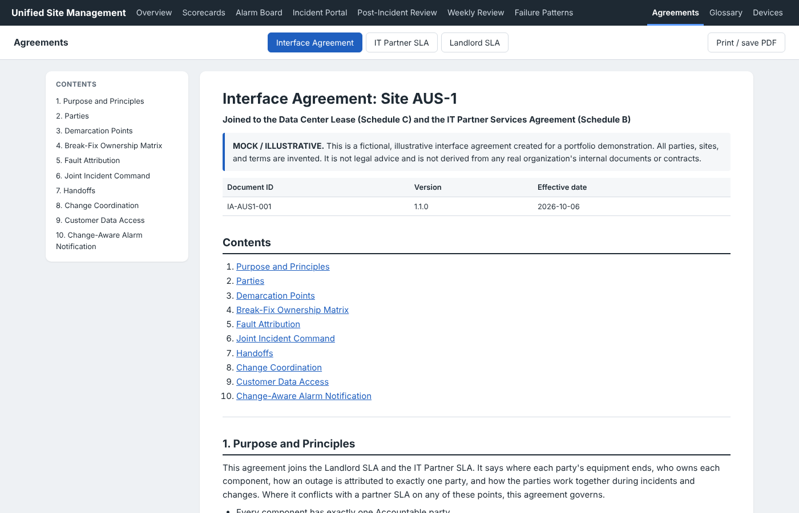

**What it shows.** The three contracts behind the site, with contents and print to PDF: the [IT Partner SLA](docs/sla/IT_PARTNER_SLA.md), the [Landlord SLA](docs/sla/LANDLORD_SLA.md), and the [Interface Agreement](docs/sla/INTERFACE_AGREEMENT.md) that joins them (demarcation points, one break-fix ownership matrix with exactly one Accountable party per component, fault attribution, joint incident command, handoffs, change coordination, Customer data access, and change-aware alarm notification).

**How it works.** The contracts are YAML, and the documents, the generator, the engines, the scorecards, and the glossary all read the same files, so the text and the scoring cannot drift apart. Shared terms live in `sla/common.yaml`; each partner file (`it_partner.yaml`, `ot_partner.yaml`) extends them, and a key set in both is an error, so a partner contract can add terms but never override a common one. `scripts/render_sla.py` validates the YAML and renders the Markdown; `scripts/render_agreements.py` renders the pages. Highlights of the design:

- **Telemetry of Record:** repair clocks start at the first machine-detected fault, not when a ticket is opened.
- **"Fixed" means validated:** clocks stop only when the component passes its return-to-service checks (diagnostics, NVLink health, leak hold, burn-in).
- **Ticket handling rules:** a refault within 60 minutes voids the restore; a refault within the stability window reopens the ticket; opening a new ticket to restart the clock is a record-integrity finding.
- **Rule cards per fault class** (GPU, NVLink switch, link, PSU, power shelf, CDU, leak) define the detection signal, T0, evidence, validation, clock stop, and stability window, so partner and Customer measure identically.
- **Capacity accounting** in capacity-weighted GPU-hours, with a worst-rack floor so a good fleet average cannot hide one failing rack.
- **Record Integrity** is a service level: credits apply when partner records do not reconcile with telemetry.
- **EHS for every partner** (OSHA 1910/1926/1904, NFPA 70E-2027, 70B, 855, 110, 72, 51B): 12 site safety rules and three violation classes; EHS credits apply only to independently confirmed violations and are never based on reported injuries or near misses.
- **Fault attribution** walks each rack's power and cooling paths in the site model to decide which side of the demarcation an outage started on (FA-1), and starts the other partner's clock only at the handoff (FA-3).

## Glossary and code popups

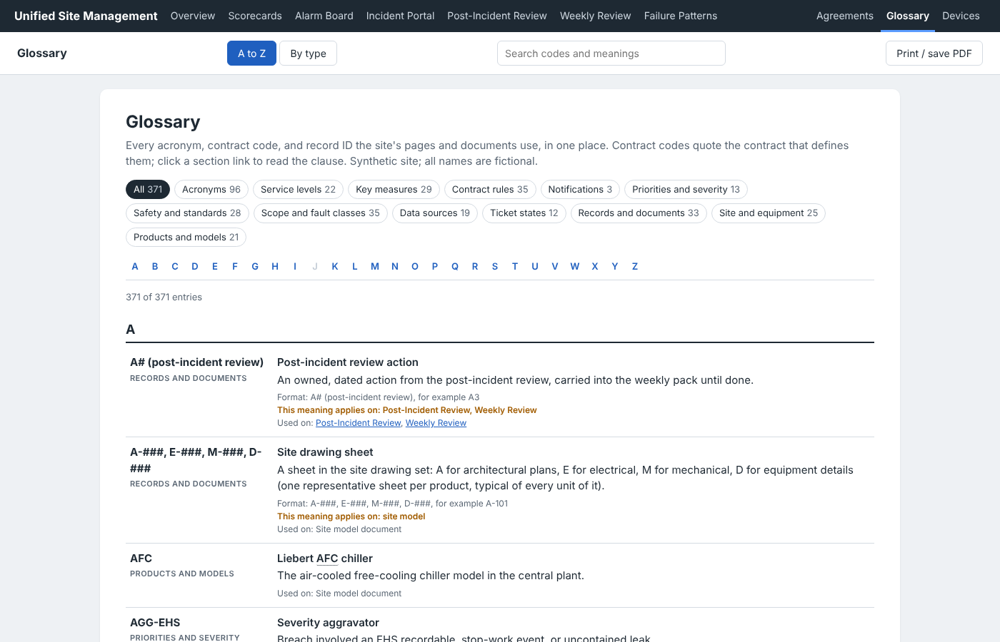

**What it shows.** Every acronym, contract code, and record ID the site uses (371 entries), A to Z or by type, with search. On every page each code has a dotted underline; clicking it opens a small card with its meaning and a link to the clause that defines it, without leaving the page. The Scorecards app has a "Look up a code" panel.

**How it works.** Contract meanings are quoted from the same YAML the scorecards are scored against (`config/glossary.yaml` points at contract paths rather than retyping them); acronyms and record families (format and an example) are written once. `scripts/render_glossary.py` scans the text of every page, contract, review, and pack for code-shaped tokens, and its `--check` mode fails CI if any of them has no meaning in the glossary. The popup script is one shared partial (`templates/partials/glossary_popup.html`).

## Devices, location pins, and detail sheets

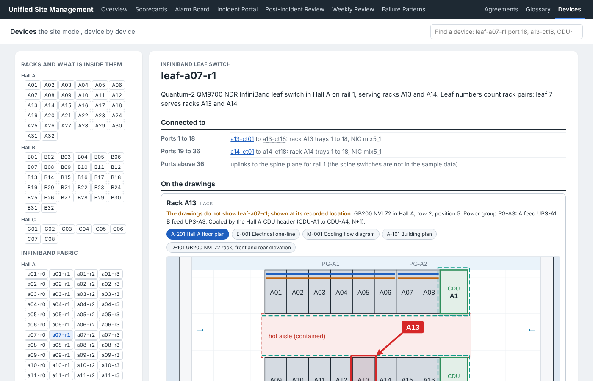

**What it shows.** All 2,768 named devices at the site (racks and the compute trays, NVLink switch trays, and power shelves inside them; InfiniBand leaf switches and their ports; busways, tap-offs, UPSs, substations, MV switchgear, generators, CDUs, thermal walls, chillers, pumps, VESDA, and leak detection), each with a description, what it connects to, and where it is on the drawings. Device names on every page are underlined like codes: clicking one opens a card with its connections, each of which opens its own card.

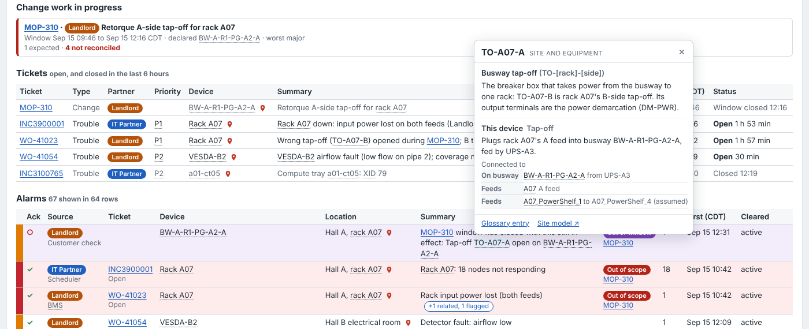

Fields that name a rack, room, or device carry a red **location pin** that opens the site drawing with the item outlined and an arrow. A pin on an alarm that names a part (pump 2, PSU 5 in power shelf 1, fan 6, a compressor, leak circuit 8, leaf port 18) opens the **equipment detail sheet** first with that part outlined.

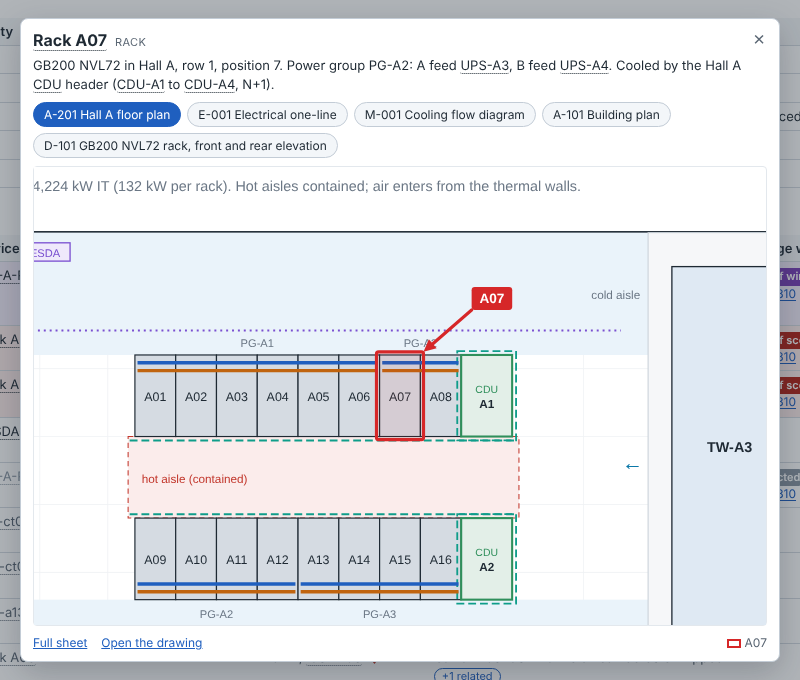

**How it works.**
- `src/scorecard/devices.py` builds the directory from the site model, the rack inventory, and the generator's own cabling rule (imported, not retyped): leaf-aNN serves racks 2N-1 and 2N, so "leaf-a07-r1 port 18" is cabled to rack A13 tray 18, NIC mlx5_1. Tests check every cable against the telemetry's own port records (8,896 of 8,896 across the robustness months).
- The drawings are generated SVG (`src/scorecard/site_drawings.py`, `src/scorecard/detail_drawings.py`). While drawing, the code records where it put each item, so `docs/site/locations.json` comes from the drawing code itself, never from hand placement.
- 12 equipment detail sheets, one per product (GB200 and GB300 NVL72 racks, CDU, thermal wall, free-cooling chiller, Galaxy VX and VL UPSs, busway and tap-off, generator, VESDA, TraceTek, InfiniBand leaf switch), with each part's source or stated assumption in `site/details.yaml`.

## The site

Site AUS-1 is a fictional AI data center in Central Texas built from real, interoperable equipment: Schneider Electric Galaxy UPS and EcoStruxure monitoring, CoolIT CHx2000 CDUs, Vertiv Liebert thermal walls and free-cooling chillers, Caterpillar C175-16 generators, VESDA aspirating smoke detection, TraceTek leak detection, NVIDIA Quantum-2 InfiniBand, and an Eaton MVSST feeding an 800 VDC pilot hall. Hall A is in production (32 x GB200 NVL72), Hall B in deployment (32 x GB300 NVL72), and Hall C planned as the 800 VDC pilot.

The site is code too. [`site/site.yaml`](site/site.yaml) lists every product with its rating, management interfaces, and source documentation; `src/scorecard/site_model.py` expands it into named equipment, traces each rack's power and cooling paths, and runs 25 capacity checks (UPS 4-make-3, CDU N+1, generators N+1, chillers at a 43 °C design day). The site refuses to load if any check fails, and the drawing set is generated from the same file ([`docs/site/SITE.md`](docs/site/SITE.md)).

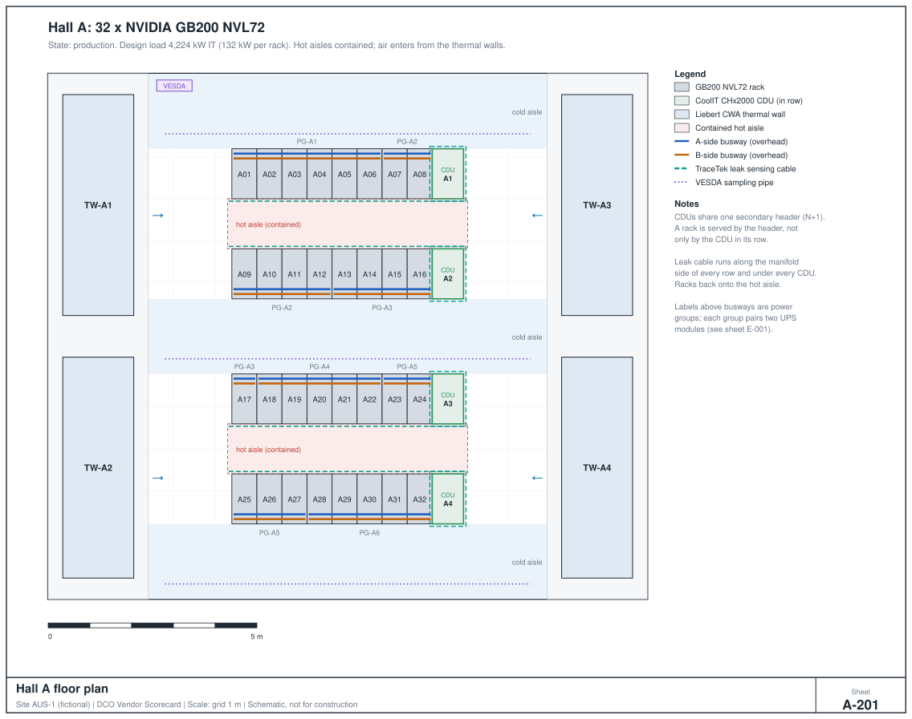

## The data and the engines

**Two views of the same month.** `scripts/generate_data.py` simulates the site for four weeks and writes what the **equipment and Customer systems** recorded (GPU XID events, BMC inventory and alarms, fabric events, CDU, UPS, busway, generator, BMS, leak and VESDA telemetry, scheduler states, validation checks, badge access) and what the **partners** reported (tickets, work orders, maintenance records, rosters, spares ledger, deployment milestones, weekly self-reports). It then plants realistic discrepancies, such as a ticket claiming a part swap the BMC inventory never saw, a technician "on site" before badging into the hall, or a generator test recorded as "Pass at 40% load" while the controller shows it ran unloaded, and writes an answer key. Every file is described in [`docs/DATA_MODEL.md`](docs/DATA_MODEL.md).

**One engine per partner.** `scripts/run_engine.py` (IT Partner, `src/scorecard/engine/`) and `scripts/run_landlord.py` (Landlord, `src/scorecard/engine/landlord.py`) read the data through a connector layer (`src/scorecard/connectors.py`, one interface per source), rebuild every incident from telemetry alone using the contract's ticket handling rules, and report each place the partner's records do not reconcile, with the exact evidence, an S1 to S4 severity, and the corrective action the SLA defines. **The engines cannot read the answer key:** the connector blocks it, and a test deletes the answer key and confirms the findings do not change. Reports: [IT scorecard](reports/scorecard.md), [IT discrepancies](reports/discrepancy_report.md), [Landlord scorecard](reports/landlord_scorecard.md), [Landlord discrepancies](reports/landlord_discrepancy_report.md), [attribution](reports/attribution_report.md), [site summary](reports/site_summary.md).

A finding means the records do not reconcile, not that someone lied. It starts a review.

## Measuring on months the code never saw

Every detector is scored on freshly generated months it was not tuned on, with the planted cases moved each time:

| Check | Sample month | 60 generated months |
|---|---|---|
| IT Partner discrepancy engine | 17 of 17 | 1,020 of 1,020, 0 false positives |
| Landlord engine | 8 of 8 | 480 of 480, 0 false positives |
| Facility evidence | | 60 of 60 |
| Failure patterns | 3 found, 0 other flags | optic lot 60/60, CDU drift 60/60, reseat 41/60, decoys 0/60 |
| Change-aware alarms | 120 alarms, 11 expected, 4 flags (all MOP-310) | every case 60/60, decoys 0/60 |
| PUE report and free-cooling lockouts | 2 of 2 | 109 of 109 (report errors 49/49, cause named 49/49; lockouts 60/60), 0 false positives |
| GPU health checks | 7 of 7 | 548 of 548, 0 false positives (decoys: 1,942 stable remaps, 120 error bursts, 1,159 brief slowdowns) |
| GPU telemetry agreement with the records | 60,257 of 60,257 cases | 8,520,414 of 8,520,414 cases on 60 generated months |
| Deployment record checks | 4 of 4 | 240 of 240 (60 per check), 0 false positives (decoys: 88 pending signatures, 97 retested inspections, 60 tight energizations) |
| Related-record suggestions | 18 of 18 links recovered, 0 of 715 decoys, 11 pairs suggested | 604 of 604 links, 0 of 45,580 decoys (same place far apart, same time other hall, same fault only), 21.4 pairs a month |
| Detail-sheet parts and device names | | parts 7,926/7,926, names 13,076/13,076, leaf cables 8,896/8,896 |

```bash
python scripts/run_engine.py --robustness 60
python scripts/run_landlord.py --robustness 60
python scripts/render_patterns.py --robustness 60
python scripts/render_alarms.py --robustness 60
python scripts/render_energy.py --robustness 60
python scripts/render_gpu_health.py --robustness 60
python scripts/render_telemetry.py --robustness 60
python scripts/render_tickets.py --robustness 60
python scripts/render_deployments.py --robustness 60
```

## Toward live data: the read-only collector

`scripts/collect.py` reads real facility equipment and writes the same files the synthetic generator writes, so the engines, scorecards, and pages run on live data without changes.

- **Four protocols:** Redfish (CDUs, DMTF `ThermalEquipment`), Modbus TCP (generator controllers, busway monitors, leak controllers), SNMPv3 with authentication and AES privacy (UPS management cards), and BACnet/IP (BMS points, with overrides read from the priority array).
- **Read-only by construction:** only Redfish GET and Modbus read requests (function codes 3 and 4). A test scans the collector's code and fails on any write-capable call, and the simulators record every request to prove it.
- **Tested against device simulators** in CI (a Redfish server, pymodbus, a pysnmp SNMPv3 agent, a bacpypes3 BACnet device), including end-to-end runs of a CDU pump failure and a BMS override into the unchanged Landlord engine. [`docs/LIVE_READINESS.md`](docs/LIVE_READINESS.md) lists what is proven and what a real deployment still needs.
- Credentials stay in named environment variables, and a device that stops answering becomes a measured feed gap, not a silent one.

## Tests and deployment

- **540 tests** (pytest) run on every push. They cover the contracts, the site model's capacity checks, the generator, both engines, the scorecards, the app (against `tests/fake_streamlit.py`), and the written reviews held to the facts. The PIR and weekly pages are exercised in a real DOM with jsdom (`tests/js/`).
- **Generated files are checked, not trusted:** CI runs each renderer with `--check` (contracts, drawings, Landlord reports, reviews, packs, patterns, alarms, glossary), and the tests fail if any committed copy is stale.
- **Deploy:** the "Deploy demo to GitHub Pages" workflow runs the tests, generates a fresh "latest 4 weeks" dataset, builds the static site with `scripts/build_site.py`, and publishes it. It also runs every Monday at 06:00 UTC so that dataset stays current.
- To host on AWS instead (S3, EC2, or a production-shaped architecture), see [`docs/DEPLOY_AWS.md`](docs/DEPLOY_AWS.md).

## Run it locally

```bash
pip install -r requirements-live.txt     # everything, including the live collector's tests
python scripts/render_sla.py && python scripts/render_site.py && python scripts/generate_data.py \
  && python scripts/run_engine.py && python scripts/build_scorecard.py && python scripts/run_landlord.py \
  && python scripts/render_pir.py && python scripts/render_weekly.py \
  && python scripts/generate_history.py && python scripts/render_patterns.py \
  && python scripts/generate_changes.py && python scripts/render_alarms.py && python scripts/render_glossary.py
pytest -q
python scripts/build_site.py --out _site    # the whole site; serve it with: python -m http.server -d _site
streamlit run app/streamlit_app.py          # the Scorecards app on its own
```

## Project layout

<details>
<summary>Every file that matters, and what it does</summary>

```
sla/common.yaml                  Terms shared by every partner SLA (add-only merge)
sla/it_partner.yaml              IT Partner SLA: service levels, credits, finding types
sla/ot_partner.yaml              Landlord SLA: power, cooling, maintenance, response, credits against rent
sla/interface_agreement.yaml     Demarcation, ownership matrix, fault attribution, joint operations, data access, alarm notification
site/site.yaml                   Single source of truth for the site: equipment, topology, monitoring
site/details.yaml                Equipment detail sheets: parts, sources, and alarm-text mappings
src/scorecard/site_model.py      Site expansion, power and cooling paths, capacity checks
src/scorecard/site_drawings.py   Site drawing set (SVG) generated from the site model
src/scorecard/detail_drawings.py Equipment detail sheets (SVG)
src/scorecard/locations.py       Where each item is drawn (docs/site/locations.json) for location pins
src/scorecard/devices.py         Device directory: every named device and its connections (docs/site/devices.json)
config/synthetic.yaml            Generator settings: fault rates, partner behavior, planted discrepancies
src/scorecard/synthetic/         Synthetic site data generator (sample, history, and change layers)
src/scorecard/sla_model.py       Load, validate, credit math, severity classification
src/scorecard/measurement.py     Ticket handling rules as the reference implementation
src/scorecard/connectors.py      Data access layer (one interface per source; answer key blocked)
src/scorecard/engine/            IT Partner discrepancy engine; landlord.py: Landlord engine and attribution
src/scorecard/kpi.py             Service level measurement from telemetry, for any period
src/scorecard/builder.py         Scorecard: SLA results, reported vs. measured, credits, severity log, CAPs
src/scorecard/pir.py             Post-incident review facts and timeline (also used by the Incident Portal)
src/scorecard/weekly.py          Weekly operations review facts, as of each week's end
src/scorecard/patterns.py        Failure pattern statistics, evidence for a cause, owner from the RACI
src/scorecard/alarms.py          Change-aware alarms: one feed, classified against declared changes
src/scorecard/energy.py         PUE and partial PUE from the meters; report and free-cooling checks
src/scorecard/gpu_health.py     GPU health checks: early warning, remap pending at return to service, thermal walk
src/scorecard/deployments.py     Deployment program: steps, calculation sheet, work orders, gate status, record checks
src/scorecard/jira_import.py     Read-only importer for the partners' Jira exports (JSON or CSV, through a field map)
src/scorecard/tickets.py         Incident Portal records with timelines and measurements
src/scorecard/glossary.py        Code meanings, lookup, and tokenizer used by render_glossary.py
src/scorecard/sitenav.py         The tab bar on every page and ticket-number links
src/scorecard/live/              Read-only collector, protocol adapters, dataset writer
app/streamlit_app.py             Scorecards app (Streamlit; runs in the browser via stlite)
pir/reviews/*.yaml               Written part of each post-incident review
weekly/notes/*.yaml              Written part of a weekly review (decisions, asks, commentary)
patterns/lessons.yaml            Written part of the pattern review (root causes, lessons, actions)
config/change_alarms.yaml        Alarm map, change-type catalog, robustness plants
config/energy.yaml               Weather, chiller plant, and meter model for the energy layer; PUE check thresholds
config/gpu_health.yaml           GPU health layer: watches per XID, thresholds, plants
config/glossary.yaml             Code meanings: contract paths, acronyms, record families
config/deployments.yaml          Deployment standard work: gates, steps, sign-off roles, inspections, authority profiles
config/deployments_data.yaml     Synthetic deployment record settings and planted records
config/jira_fields.yaml          Jira field map: project keys, custom field ids, CSV headers, status categories
scripts/render_*.py              One renderer per page or document (sla, site, hub, pir, weekly, patterns, alarms, energy, gpu_health, deployments, tickets, glossary, agreements, devices)
scripts/generate_*.py            Synthetic data: sample, history, change layer, energy meters, GPU health, deployment record
scripts/run_engine.py            IT Partner engine -> reports/
scripts/run_landlord.py          Landlord engine -> Landlord and attribution reports
scripts/build_scorecard.py       Scorecard -> reports/
scripts/build_site.py            The static GitHub Pages site
scripts/collect.py               Read-only live collector
docs/                            Generated contracts, drawings, reviews, packs, glossary; guides
data/                            Committed synthetic sample, history, and change layer
reports/                         Generated scorecards, findings, and reviews (Markdown and JSON)
tests/                           Pytest suite and jsdom page tests
```

</details>

New to the code? Start with [docs/PROJECT_GUIDE.md](docs/PROJECT_GUIDE.md).

---

Copyright 2026 Jason Mossotti. All rights reserved. Shared for portfolio review only. See [LICENSE](LICENSE).
