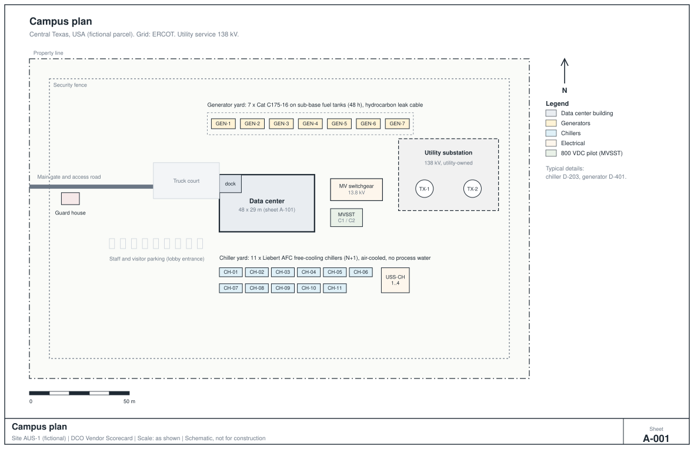
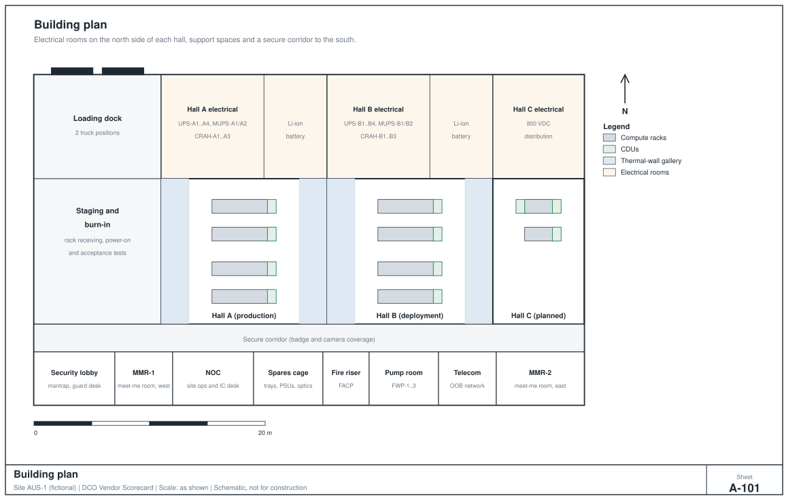
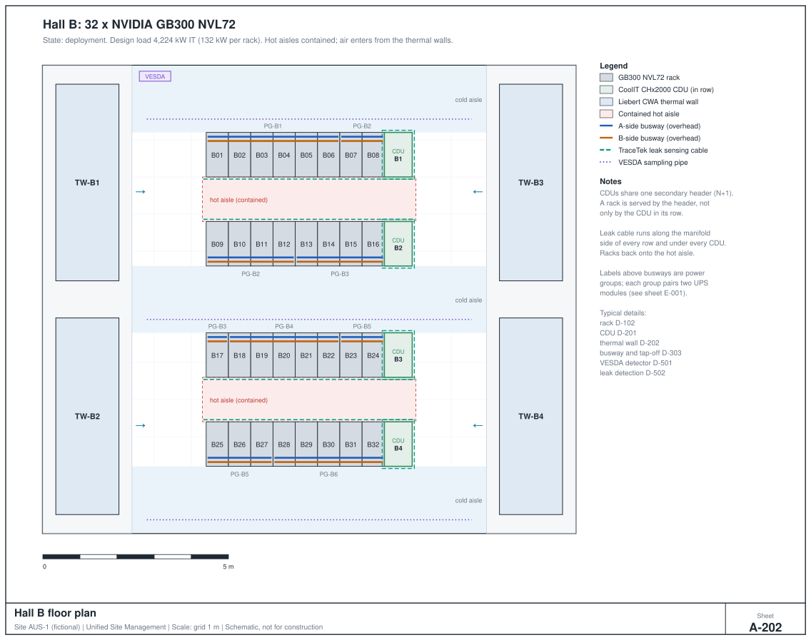
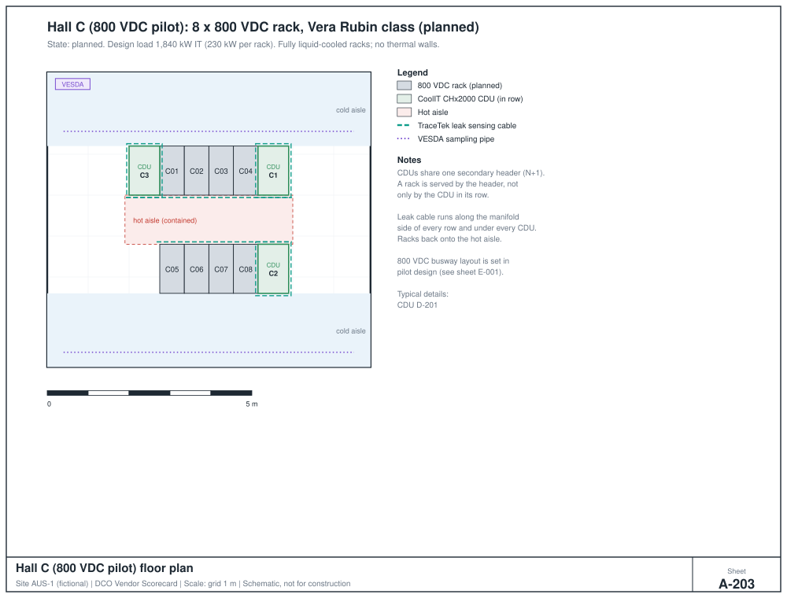
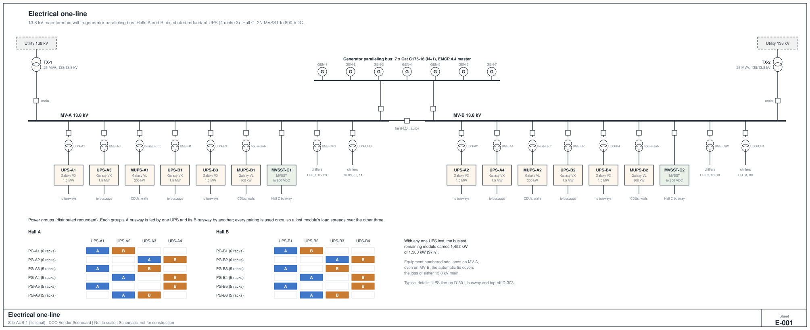
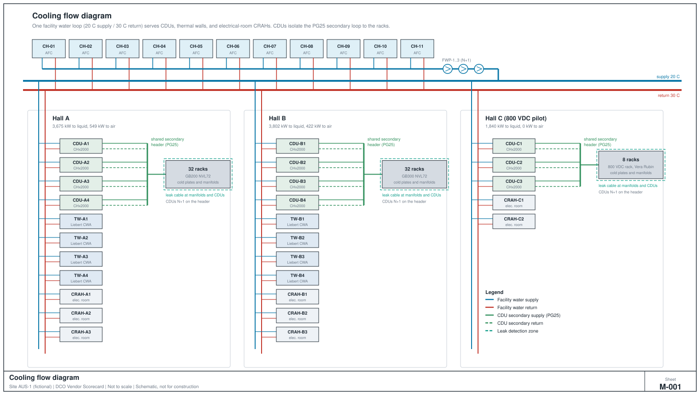
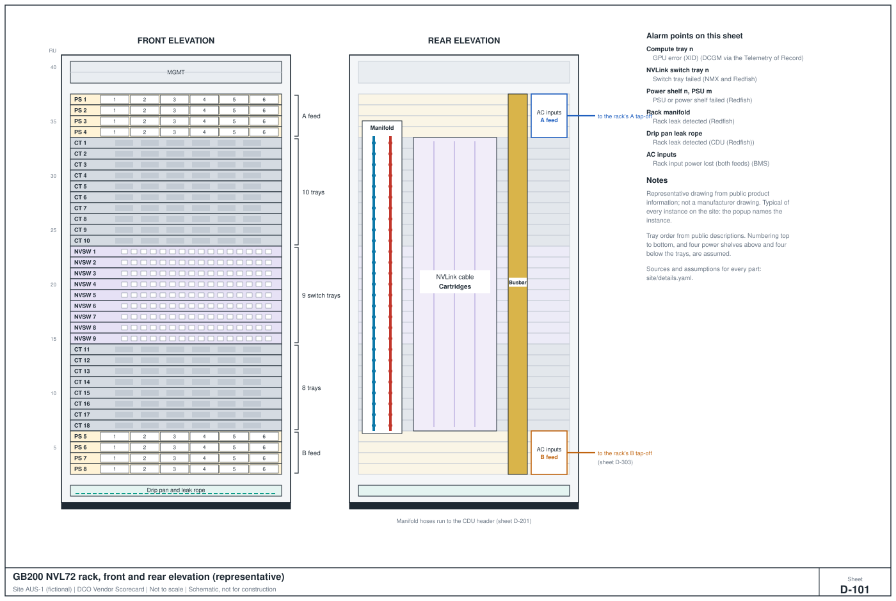
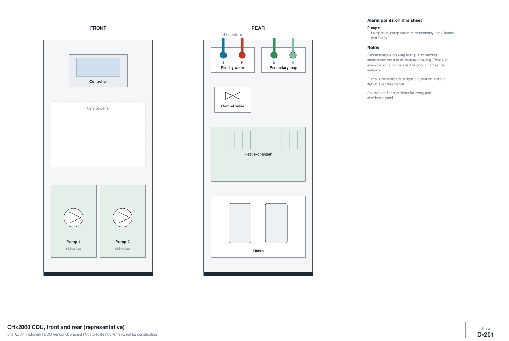
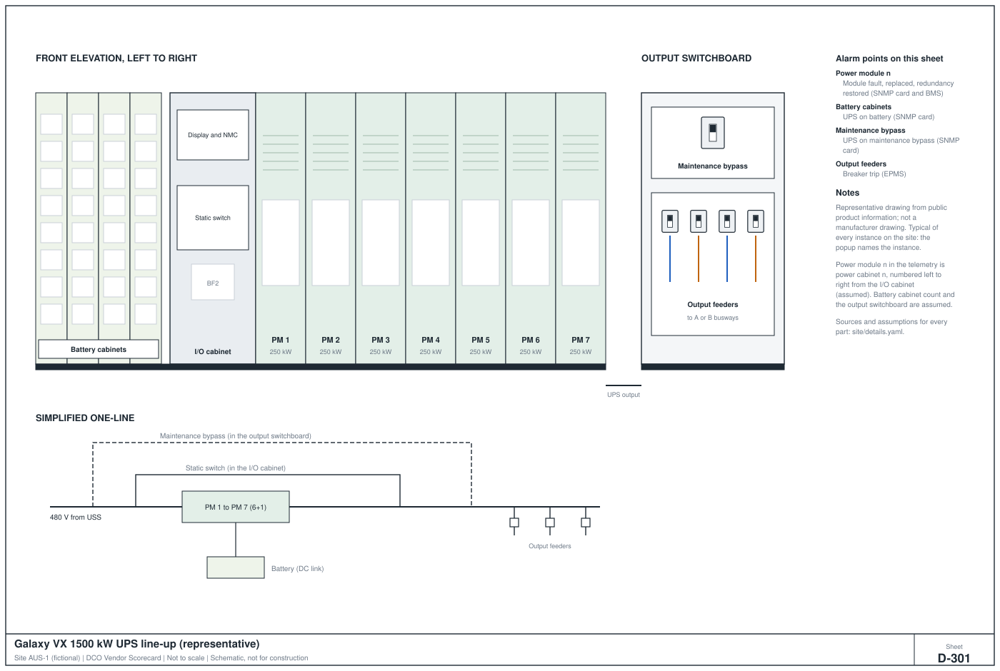
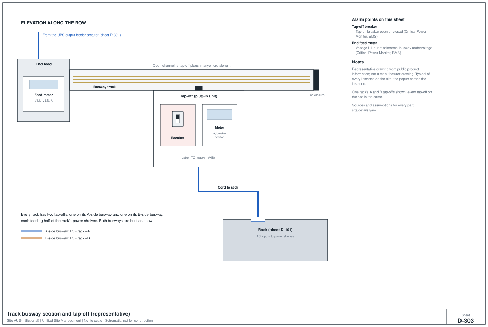

# Site AUS-1 (fictional): site description

> Generated from `site/site.yaml` by `scripts/render_site.py`. Do not edit by hand.
>
> Fictional site for a portfolio demonstration. Equipment models are real products; the site, its layout, quantities, and operators are invented. Schematic only: not a construction document.

Central Texas, USA (fictional parcel), on the ERCOT grid. Utility service at 138 kV, site distribution at 13.8 kV, utilization at 480 V. The building is about 48 m by 29 m. Design-day IT load is 10,288 kW and the design-day peak at the 13.8 kV bus is 15,169 kW.

## Halls

| Hall | State | Racks | Design IT load | Power | CDUs | Compute fabric |
|---|---|---|---|---|---|---|
| Hall A | production | 32 x GB200 NVL72 | 4,224 kW | 4 x Galaxy VX, distributed redundant (4 make 3) | 4 x CHx2000 (N+1) | Quantum-2 QM9700 NDR InfiniBand switch |
| Hall B | deployment | 32 x GB300 NVL72 | 4,224 kW | 4 x Galaxy VX, distributed redundant (4 make 3) | 4 x CHx2000 (N+1) | Quantum-X800 Q3400-RA XDR InfiniBand switch |
| Hall C (800 VDC pilot) | planned | 8 x 800 VDC rack, Vera Rubin class (planned) | 1,840 kW | 2 x Eaton MVSST, 2N, 800 VDC | 3 x CHx2000 (N+1) | Quantum-X800 Q3400-RA XDR InfiniBand switch |

## Drawings

| Sheet | Title |
|---|---|
| A-001 | [Campus plan](A-001_campus_plan.svg) |
| A-101 | [Building plan](A-101_building_plan.svg) |
| A-201 | [Hall A floor plan](A-201_hall_a_plan.svg) |
| A-202 | [Hall B floor plan](A-202_hall_b_plan.svg) |
| A-203 | [Hall C (800 VDC pilot) floor plan](A-203_hall_c_plan.svg) |
| E-001 | [Electrical one-line](E-001_one_line.svg) |
| M-001 | [Cooling flow diagram](M-001_cooling_flow.svg) |
| D-101 | [GB200 NVL72 rack, front and rear elevation](D-101_gb200_nvl72_rack.svg) |
| D-201 | [CHx2000 CDU, front and rear](D-201_chx2000_cdu.svg) |
| D-301 | [Galaxy VX 1500 kW UPS line-up](D-301_galaxy_vx_1500_kw_ups_line_up.svg) |
| D-303 | [Track busway section and tap-off](D-303_track_busway_section_and_tap_off.svg) |

### A-001 Campus plan

### A-101 Building plan

### A-201 Hall A floor plan

### A-202 Hall B floor plan

### A-203 Hall C (800 VDC pilot) floor plan

### E-001 Electrical one-line

### M-001 Cooling flow diagram

### D-101 GB200 NVL72 rack, front and rear elevation

### D-201 CHx2000 CDU, front and rear

### D-301 Galaxy VX 1500 kW UPS line-up

### D-303 Track busway section and tap-off

## Who operates what

| Party | Name | Role |
|---|---|---|
| Customer | Customer | Leases the halls; owns the IT equipment and site outcomes; operates the Telemetry of Record. |
| It partner | Ridgeline Site Services, LLC (fictional) | Deployment, break-fix, and data hall IT operations. |
| Landlord | Caprock Critical Facilities, LLC (fictional) | Wholesale data center owner-operator: owns and operates the building, power, cooling, fire protection, and building monitoring; leases the halls to the Customer. |
| Security partner | To be contracted | Access control, CCTV, escorts (later phase). |
| Utility | Serving utility (ERCOT region) | Owns the 138 kV substation and its transformers; serves the Landlord. |

## Equipment

| Category | Product | Count | Rating | Management interfaces |
|---|---|---|---|---|
| Compute rack | NVIDIA GB200 NVL72 | 32 | 132 kW | Redfish (BMC); NVLink telemetry via NMX; InfiniBand via UFM |
| Compute rack | NVIDIA GB300 NVL72 | 32 | 132 kW | Redfish (BMC); NVLink telemetry via NMX; InfiniBand via UFM |
| Compute rack | NVIDIA ecosystem (to be selected) 800 VDC rack, Vera Rubin class (planned) | 8 | 230 kW | Redfish (BMC) |
| UPS | Schneider Electric Galaxy VX 1500 kW, 480 V | 8 | 1,500 kW | SNMPv3 (Network Management Card); Modbus TCP; HTTPS |
| UPS | Schneider Electric Galaxy VL 300 kW, 480 V (mechanical UPS) | 4 | 300 kW | SNMPv3 (Network Management Card); Modbus TCP |
| Battery | Schneider Electric Galaxy Lithium-ion Battery System | 12 (one per UPS) |  | Reported through the UPS |
| Busway | Starline (Legrand) Track Busway 1200T5 with Critical Power Monitor | 36 | 1,200 A | Modbus TCP / SNMP via Critical Power Monitor |
| Transformer | 13.8 kV to 480 V unit substation, 2500 kVA (to be selected) | 12 | 2,500 kVA | Metered via PowerLogic into Power Monitoring Expert |
| Transformer | 138 kV to 13.8 kV power transformer, 25 MVA (utility-owned) | 2 | 25,000 kVA | Utility SCADA (not customer accessible); site metering at the 13.8 kV mains |
| Solid-state transformer | Eaton MVSST, 15 kV class, 2.5 MW (pilot) | 2 | 2,500 kW | To be confirmed in pilot submittals |
| Generator | Caterpillar C175-16, 13.8 kV, EMCP 4.4 | 7 | 3,000 kW | Modbus TCP (EMCP 4.4); Modbus RTU; EMCP 4.4 master panel to BMS |
| CDU | CoolIT Systems CHx2000 row-based CDU | 11 | 2,000 kW | Redfish; SNMP; Modbus TCP; BACnet |
| Thermal wall | Vertiv Liebert CWA thermal wall, 400 kW configuration | 8 | 400 kW | BACnet/IP via unit controller |
| CRAH | Vertiv Liebert CW perimeter CRAH, 100 kW (electrical rooms) | 8 | 100 kW | BACnet/IP via unit controller |
| Chiller | Vertiv Liebert AFC air-cooled free-cooling chiller, 1500 kW nominal | 11 | 1,500 kW | BACnet/IP; Modbus |
| Pump | Facility water pump, VFD driven (to be selected) | 3 |  | BACnet/IP via VFD |
| Smoke detection | Xtralis (Honeywell) VESDA-E VEP aspirating smoke detector | 5 |  | VESDAnet to fire panel (primary); Modbus HLI to BMS (secondary) |
| Fire panel | Notifier (Honeywell) Addressable fire alarm control panel | 1 |  | BACnet gateway to BMS (secondary monitoring) |
| Leak detection | Chemelex (nVent RAYCHEM TraceTek) TTDM-128 alarm and locator module | 3 |  | Modbus RTU (RS-485) via gateway to Modbus TCP |
| Leak cable | Chemelex (nVent RAYCHEM TraceTek) Water and conductive-fluid sensing cable (PG25 coolant) | 21 circuits |  | Monitored by TTDM-128 |
| Leak cable | Chemelex (nVent RAYCHEM TraceTek) TT5000 hydrocarbon sensing cable (generator diesel) | 7 circuits (one per fuel tank) |  | Monitored by TTDM-128 |
| InfiniBand switch | NVIDIA Quantum-2 QM9700 NDR InfiniBand switch | set in fabric design |  | UFM; SNMP; gNMI |
| InfiniBand switch | NVIDIA Quantum-X800 Q3400-RA XDR InfiniBand switch | set in fabric design |  | UFM; gNMI |

Busway counts are A and B tracks per row segment. Every count comes from the site model, so a change to `site/site.yaml` updates this table and the drawings together.

## Capacity checks

Every check must pass or the site file will not load, the same way the SLA refuses to load if inconsistent.

| Scope | Check | Load | Capacity | Utilization | Limit | Result | Basis |
|---|---|---|---|---|---|---|---|
| Hall A | UPS, normal (busiest module) | 1,056 kW | 1,500 kW | 70% | 80% | Pass | 4 x 1,500 kW sharing 4,224 kW |
| Hall A | UPS, one module lost (4 make 3) | 1,452 kW | 1,500 kW | 97% | 100% | Pass | lost module's groups shift to their other feed |
| Hall A | Unit substation (worst UPS input) | 1,663 kVA | 2,500 kVA | 67% | 100% | Pass | UPS input at worst case plus battery recharge |
| Hall A | Busway, one feed lost (largest segment) | 962 A | 1,200 A | 80% | 90% | Pass | 6 racks x 132 kW on one 1200 A busway |
| Hall A | Mechanical UPS (2N, one unit carries all) | 129 kW | 300 kW | 43% | 100% | Pass | CDU pumps and thermal-wall fans |
| Hall A | CDU heat, N+1 | 3,675 kW | 6,000 kW | 61% | 100% | Pass | 3 of 4 CDUs carry the liquid load |
| Hall A | CDU flow, N+1 | 4,410 LPM | 5,400 LPM | 82% | 100% | Pass | 1.2 LPM per kW of liquid load |
| Hall A | Thermal walls, N+1 | 549 kW | 1,200 kW | 46% | 100% | Pass | air-side share of rack heat |
| Hall A | Electrical room CRAH, N+1 | 131 kW | 200 kW | 65% | 100% | Pass | power conversion losses |
| Hall B | UPS, normal (busiest module) | 1,056 kW | 1,500 kW | 70% | 80% | Pass | 4 x 1,500 kW sharing 4,224 kW |
| Hall B | UPS, one module lost (4 make 3) | 1,452 kW | 1,500 kW | 97% | 100% | Pass | lost module's groups shift to their other feed |
| Hall B | Unit substation (worst UPS input) | 1,663 kVA | 2,500 kVA | 67% | 100% | Pass | UPS input at worst case plus battery recharge |
| Hall B | Busway, one feed lost (largest segment) | 962 A | 1,200 A | 80% | 90% | Pass | 6 racks x 132 kW on one 1200 A busway |
| Hall B | Mechanical UPS (2N, one unit carries all) | 129 kW | 300 kW | 43% | 100% | Pass | CDU pumps and thermal-wall fans |
| Hall B | CDU heat, N+1 | 3,802 kW | 6,000 kW | 63% | 100% | Pass | 3 of 4 CDUs carry the liquid load |
| Hall B | CDU flow, N+1 | 4,562 LPM | 5,400 LPM | 84% | 100% | Pass | 1.2 LPM per kW of liquid load |
| Hall B | Thermal walls, N+1 | 422 kW | 1,200 kW | 35% | 100% | Pass | air-side share of rack heat |
| Hall B | Electrical room CRAH, N+1 | 131 kW | 200 kW | 65% | 100% | Pass | power conversion losses |
| Hall C (800 VDC pilot) | MVSST (2N, one unit carries all) | 1,868 kW | 2,500 kW | 75% | 100% | Pass | 8 racks x 230 kW |
| Hall C (800 VDC pilot) | CDU heat, N+1 | 1,840 kW | 4,000 kW | 46% | 100% | Pass | 2 of 3 CDUs carry the liquid load |
| Hall C (800 VDC pilot) | CDU flow, N+1 | 2,208 LPM | 3,600 LPM | 61% | 100% | Pass | 1.2 LPM per kW of liquid load |
| Hall C (800 VDC pilot) | Electrical room CRAH, N+1 | 28 kW | 100 kW | 28% | 100% | Pass | power conversion losses |
| Site | Chillers at 43 C, N+1 | 10,912 kW | 11,500 kW | 95% | 100% | Pass | 10 x 1,150 kW derated |
| Site | Generators, N+1 | 15,169 kW | 18,000 kW | 84% | 90% | Pass | 6 x 3,000 kW at design-day peak |
| Site | Utility transformers (2N, one carries all) | 15,968 kVA | 25,000 kVA | 64% | 80% | Pass | design-day peak at 0.95 power factor |

## Dependencies (used for fault attribution)

Each rack's power and cooling paths, upstream to the sources. When a rack goes down, walking these paths shows which system, and therefore which partner, owns the event. Example, rack A07:

- **Power, A feed:** A07 -> BW-A-R1-PG-A2-A -> UPS-A3 -> USS-A3 -> MV-A -> TX-1 -> TX-2 -> GEN paralleling bus
- **Power, B feed:** A07 -> BW-A-R1-PG-A2-B -> UPS-A4 -> USS-A4 -> MV-B -> TX-1 -> TX-2 -> GEN paralleling bus
- **Cooling:** A07 -> Hall A secondary header -> CDU-A1..A4 (N+1) -> Facility water loop -> Chiller plant

## Monitoring map

The Landlord runs EcoStruxure day to day. Under the Interface Agreement, the Customer's Telemetry of Record collector reads critical devices directly and read-only, and also receives the BMS feed, so a point overridden or an alarm inhibited at the BMS shows up as a mismatch.

| System | Role | Operated by |
|---|---|---|
| EcoStruxure Building Operation | BMS: HVAC, chillers, CDUs, thermal walls, fire and leak (secondary) | Caprock Critical Facilities, LLC |
| EcoStruxure Power Monitoring Expert | EPMS: switchgear, metering, power quality | Caprock Critical Facilities, LLC |
| EcoStruxure IT | DCIM: UPS, busway, rack power, capacity | Caprock Critical Facilities, LLC |
| Notifier fire alarm control panel | Fire alarm system of record (life safety) | Caprock Critical Facilities, LLC |
| NVIDIA UFM | InfiniBand fabric management | Ridgeline Site Services, LLC |
| NVIDIA NMX | NVLink domain management (per rack) | Ridgeline Site Services, LLC |
| Customer Telemetry of Record collector | Independent, read-only aggregation of every source; basis for SLA measurement | Customer |

| Device class | Protocol | Day-to-day system | Customer tap |
|---|---|---|---|
| UPS | SNMPv3 | EcoStruxure IT | direct (SNMPv3 read-only user) |
| Busway | Modbus TCP | EcoStruxure IT | direct (read-only) |
| Switchgear and meters | Modbus TCP | EcoStruxure Power Monitoring Expert | PME export |
| Generators | Modbus TCP (EMCP 4.4) | EcoStruxure Building Operation | direct (read-only) |
| CDUs | Redfish | EcoStruxure Building Operation | direct (Redfish read-only account) |
| Thermal walls and CRAHs | BACnet/IP | EcoStruxure Building Operation | BMS feed |
| Chillers and pumps | BACnet/IP | EcoStruxure Building Operation | BMS feed |
| Leak detection | Modbus TCP (via gateway) | EcoStruxure Building Operation | direct (read-only) |
| Aspirating smoke | Modbus HLI | EcoStruxure Building Operation | BMS feed (fire panel is the system of record) |
| Compute racks | Redfish | Customer Telemetry of Record collector | direct |
| InfiniBand fabric | UFM REST / events | NVIDIA UFM | UFM event export |

## Engineering assumptions

- Rack design envelope 132 kW for GB200 and GB300 (GB300 power-capped to the hall envelope); 230 kW for the 800 VDC pilot racks.
- Hot-day design dry bulb of 43 C; each 1,500 kW chiller derated to 1,150 kW, plant COP 3.0 on that day.
- UPS double-conversion efficiency 97%; UPS input sized with a 10% battery-recharge allowance; power factor 0.99.
- Busway may carry up to 90% of its rating with one feed lost.
- One facility water loop at 20 C supply / 30 C return serves CDUs, thermal walls, and CRAHs.
- Thermal-wall fan power 20 kW per unit; CRAH fan power 5 kW; facility water pumps 110 kW each.
- Lithium-ion runtime 5 minutes; 48 hours of generator fuel at full load; 400 kW of house load.

## Sources

Product facts in `site/site.yaml` were checked against these manufacturer and trade sources:

- NVIDIA GB200 NVL72: <https://www.szsanyi.com/en/blog/nvidia-hvdc>
- NVIDIA GB200 NVL72: <https://blog.qct.io/wp-content/uploads/2025/04/QCT-Qoolrack-Stand-Alone_Advanced-Liquid-Cooling-for-NVIDIA-GB200-NVL72-Systems.pdf>
- NVIDIA GB300 NVL72: <https://lenovopress.lenovo.com/lp2357.pdf>
- NVIDIA ecosystem (to be selected) 800 VDC rack, Vera Rubin class (planned): <https://www.moduledge.com/blog/nvidia-vera-rubin>
- Schneider Electric Galaxy VX 1500 kW, 480 V: <https://www.merten.de/produkt/gvxp250kd-galaxy-vx-250-kva-400-480-v-pwr-cab.html>
- Schneider Electric Galaxy VX 1500 kW, 480 V: <https://www.se.com/us/en/product/AP9644/network-management-card-4-nmc4-for-galaxy-vs-galaxy-vl-galaxy-vxl-remote-ups-monitoring-and-management/>
- Schneider Electric Galaxy VL 300 kW, 480 V (mechanical UPS): <https://www.merten.de/produkt/gvlopt006-galaxy-vl-vxl-paralleles-kommunikationskit-weltweit.html>
- Schneider Electric Galaxy Lithium-ion Battery System: <https://www.se.com/ie/en/work/products/master-ranges/galaxy/>
- Starline (Legrand) Track Busway 1200T5 with Critical Power Monitor: <https://www.cablinginstall.com/articles/2016/12/starline-1200t5-track-busway-system.html>
- Starline (Legrand) Track Busway 1200T5 with Critical Power Monitor: <https://starlinepower.com/products>
- Eaton MVSST, 15 kV class, 2.5 MW (pilot): <https://www.eaton.com/us/en-us/catalog/medium-voltage-power-distribution-control-systems/medium-voltage-solid-state-transformer.html>
- Caterpillar C175-16, 13.8 kV, EMCP 4.4: <https://pesa.com.br/pesaenergia-specsheets/diesel/DataSheetC175-16-3750kVAStand-by.pdf>
- Caterpillar C175-16, 13.8 kV, EMCP 4.4: <https://www.warrencat.com/new/power-systems/electric-power/switchgear-and-paralleling-controls/emcp-4-4-master-control-panel/>
- CoolIT Systems CHx2000 row-based CDU: <https://www.coolitsystems.com/product/chx2000-cdu/>
- CoolIT Systems CHx2000 row-based CDU: <https://www.coolitsystems.com/cdu-product/chx2000/>
- Vertiv Liebert CWA thermal wall, 400 kW configuration: <https://www.vertiv.com/en-us/products-catalog/thermal-management/room-cooling/liebert-cwa-chilled-water-thermal-wall-unit-from-200-to-500kw/>
- Vertiv Liebert CW perimeter CRAH, 100 kW (electrical rooms): <https://www.intelligentcio.com/north-america/2024/10/17/vertiv-codevelops-with-nvidia-complete-power-and-cooling-blueprint-for-nvidia-gb200-nvl72-platform/>
- Vertiv Liebert AFC air-cooled free-cooling chiller, 1500 kW nominal: <https://www.vertiv.com/49dc08/globalassets/products/thermal-management/free-cooling-chillers/liebert-afc-ds-en-emea-rev0---03.2020.pdf>
- Xtralis (Honeywell) VESDA-E VEP aspirating smoke detector: <https://xtralis.com/file/8501>
- Chemelex (nVent RAYCHEM TraceTek) TTDM-128 alarm and locator module: <https://cdn.chemelex.com/Product%20Documents/Design%20Guides-Forms/RAYCHEM-DG-EU0614-TraceTekOverview-EN.pdf>
- Chemelex (nVent RAYCHEM TraceTek) Water and conductive-fluid sensing cable (PG25 coolant): <https://go.nvent.com/rs/760-EGW-100/images/RaychemTraceTek-AR-H58709-FMClass7745-EN.pdf>
- Chemelex (nVent RAYCHEM TraceTek) TT5000 hydrocarbon sensing cable (generator diesel): <https://go.nvent.com/rs/760-EGW-100/images/RaychemTraceTek-AR-H53147-SensingAppGuide-EN.pdf>
- NVIDIA Quantum-2 QM9700 NDR InfiniBand switch: <https://networking-docs.nvidia.com/cablevalidationtool/2.0.1/installation-notes>
- NVIDIA Quantum-X800 Q3400-RA XDR InfiniBand switch: <https://networking-docs.nvidia.com/cablevalidationtool/2.0.1/installation-notes>
